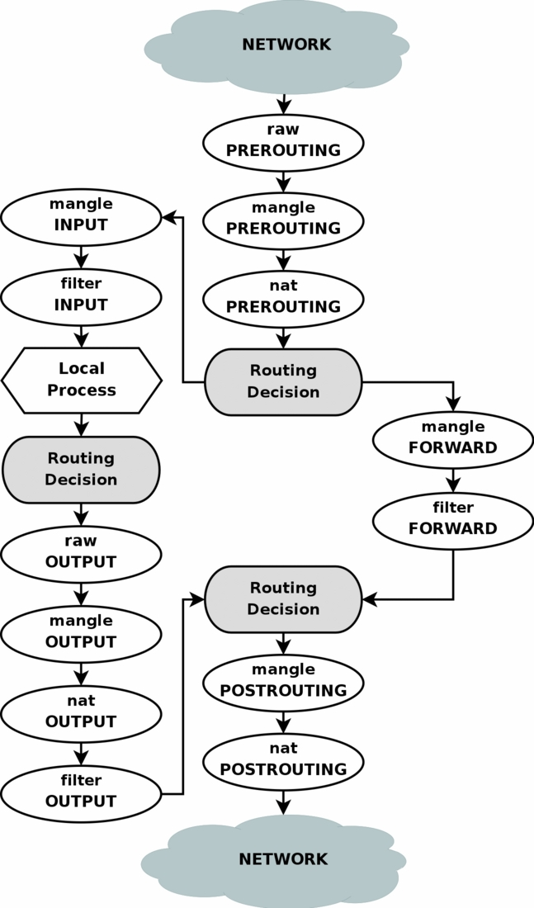

# iptables

## General - no table




If you don’t specify the -t option, it will display the default filter table


## NAT table





## Filter Table

* INPUT
* OUTPUT
* FORWARD

## Mangle table

## Raw table

* PREROUTING
* OUTPUT

