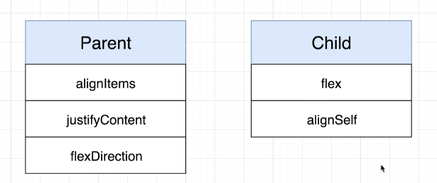

# Simple roadmap

* StyleSheet
* TextInput
  * style
  * autoCapitalize
  * autoCorrect
  * value
  * onChangeText
* FlatList
  * keyExtractor
  * horizontal
  * data
  * renderItem
* TouchableOpacity
* useState
* useReducer&#x20;
* LayoutSystem
  * Box Object Model
  * FlexBox Model\
    
  * Position Model (overwrite BOM & FlexBox Model)
* Navigators
  * DrawerNavigator
  * BottonTabNavigator
  * StackNavigator
* icons
  * [https://icons.expo.fyi/](https://icons.expo.fyi)
  *

