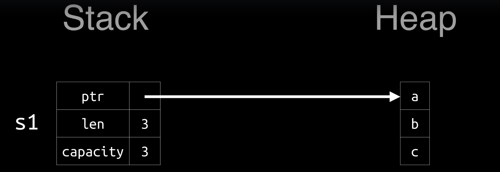

# Diary

## Help

```
cargo new proj1
```

## Dictionary

* toml&#x20;
  * Tom's obvius minimal language
* [semantic versioning](https://semver.org/)

## error: linker `link.exe` not found



## debug and release

```
cargo run
cargo run --release
```

## Variables

### Scalar Types

```rust
i32   // 32 bit integer signed
i8 i16 i32 i64 i128 isize

u32   // 32 bit integer unsigned aka bytes
u8 u16 u32 u64 u128 usize

f32 f64     // float
```

```
let mut apples = 4;
apples = 2;
```

## Error docs

```
rustc --explain E0384
```

## Libs

```
std
crates.io
```

## Compound type

* tuples
* arrays

## Loop - what a break

```rust
loop {
    loop {
        break;  // will terminate the inner loop
    }
}

// Now with a Label

'bob: loop {
    loop {
        break 'bob; // will terminate the outer loop named 'bob 
    }
}
```

### Same thing for "continue"

```rust
'bob: loop {
    loop {
        continue 'bob;
    }
}
```

## Strings

```
str

&str          -> this string cannot be modified
              -> subset of String
              
String        -> can be modified
              -> "extend" &str
```

the f am I lookin at: unicode, graphemes...

## Ownership

| Stack      | Heap          |
| ---------- | ------------- |
| ordered    | unordered     |
| fixed size | variable size |
| LIFO       | unordered     |
| fast       | slow          |


Rust saves pointers in stack and data in heap.

Every pointer has an index for data it owns indicating where data starts in the heap.




## References & Borrowing


Most of the time de-reference to pointer (living on the stack) are used.


### Mutable reference

```rust
&mut i32     // reference to mutable integer type 
x: &mut i32
*x // a mutable i32 variable
```

## No Classes only Structs

```rust
struct Animal {
    age: u8, 
}

let animal = Animal {
    age: 6,
};

impl Animal {
    // this
    fn new() -> Self {
        Self { age: 6, }
    }
    
    // also this
    fn new() -> Animal {
        Animal { age: 6, }
    }
    
    fn eat(self)
    fn borrow(&self)
    fn mut_borrow(&mut self)
}

let animal = Animal::new();
```

## Traits - Interfaces


**No Class inheritance.**\
**No Struct inheritance.**\
****_**Only Traits.**_


```rust
trait Noisy {
    fn get_noise(&self) -> &str;
}

impl Noisy for Animal {
    fn get_noise(&self) -> &str { "Woof!" }
}

/**
    Yes, you can do this.
*/
impl Noisy for u8{
    fn get_noise(&self) -> &str { "BYTE!" }
}
```


Rust has Generics:&#x20;

`<T: Noisy>` _// Anything that implements Noisy trait_


## Vector, HashMap aka Dictionary

## Enum

```rust
enum Color { Red }
let color = Color::Red;
```

```rust
enum Archives<T> {
    Empty,
    Books(u8),
    Collections(String, i32),
    Place {x: i32, y:i32 },
    Specific {x: T, y: T },
}

impl Archives {
    fn search(&self) { }
}

use Archives::*;      // take everything
let arch1 = Books(472);
let arch1 = Collections("Films", 1786);
```

### Option & Result

```rust
let mut x: Option<i32> = None;
x = Some(5);
x.is_some(); // return true
x.is_none(); // retunrn false

for i in x { println!("{}", i); } // works. prints 5 times.
```

```rust
#[must_use]    // compiler warning, tells the compiler to silently drop results
enum Result<T, E> {
    Ok(T),
    Err(E),
}

// this is a compiler warning
// it says that you SHOULD do something, like catch an error
#[warn(unused_must_use)]

result.unwrap();
result.expect("message"); // same as unwrap, if crash prints message

// full pattern
match result {
    Ok(f) => { /*do stuff*/ },
    Err(e) => { /*do stuff*/ },
}
```

## match


If match return something do not use semicolon and every check has to return the same type.


## Closures - move

```rust
let add = |x, y| { x + y };
add(3, 4); // return 7

// also

let s = "Hi!".to_string()
let mprint = || { println("{}", s) };
mprint(); // Hi!

// also with "move"

let s = "Hi!".to_string()
let mprint = move || { println("{}", s) };
mprint(); // Hi!
```

### madness

```rust
v.iter()
    .map(|x| x * 3)
    .filter(|x| *x > 10)
    .fold(0, |acc, x| acc + x);
```

## Threads

```rust
use std::thread;

fn main() {
    let handle = thread::spawn(move || {
        // omfg
    });
    
    handle.join().unwrap(); // wait until thread has exited
}
```
