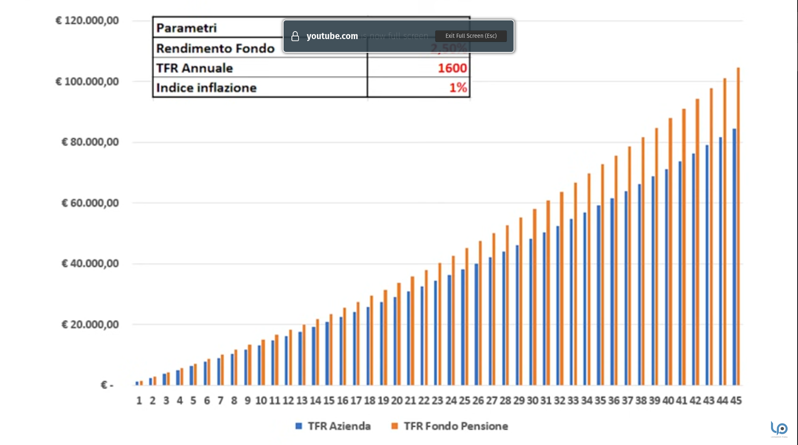

# TFR


In questo grafico l'indice di inflazione è all'1%


## Sezione 1 - modulo TFR2

* scelta del fondo pensione
* scelta di lasciarlo in azienda


Con il silenzio assenso verrà investito nel "fondo pensione di categoria"


## TL; DR.


Se non credi che avrai una lunga carriera in una azienda, lascia il TFR in azienda per riceverlo con la liquidazione.



TFR in azienda, al riparo da mercati e inflazione.


## FAQ

Se io passo per esempio da un contratto metalmeccanico a un contratto diverso, posso rimanere sullo stesso fondo (es metalmeccanico)?

Se cambi contratto hai tre scelte:&#x20;

* puoi riscuotere tutto subito (attento: paghi tasse alte (23%), inoltre perdi l'anzianità di iscrizione ai Fondi Pensione)
* lasci che il fondo metalmeccanico prosegua tranquillamente e lo riscuoti in un secondo momento oppure al momento del pensionamento (informati bene sulle relative regole)
* trasferisci il fondo metalmeccanico nel fondo del nuovo settore lavorativo

## Sources




